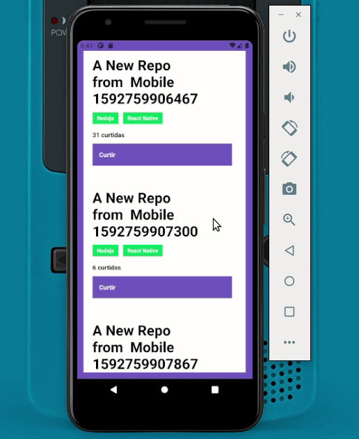

# Repository Like Web

A simple mobile interface to 'give a like' to a repository from a list of them.

## App

## Why

That project is the second challenge from the course Go Stack from [Rocket Seat](https://github.com/Rocketseat). And I'm adding this project for my personal portifolio, so if you could let me any feedback I'd appreciate so much. Any comment that can make me a better programmer will be help a lot!

And for sure, you can use this Project as you wish!

It's free!

## Contact info

My [LinkedIn](https://www.linkedin.com/in/bruno8moura/)

My email bruno8moura@gmail.com

## Getting started

### Prerequisites

NodeJS version: ^12

## Running application

yarn dev

## Build with

- [@babel/core](https://www.npmjs.com/package/@babel/core) - It is the babel core.
- [axios](https://www.npmjs.com/package/axios) - A lib ot make http requests. It is a good choice because we can patterned the url base for a especifi domain.
- [axios-mock-adapter](https://www.npmjs.com/package/axios-mock-adapter) - Axios adapter that allows to easily mock requests. Just for mock http requests.
- [react](https://www.npmjs.com/package/react) - The core library for React.
- [@testing-library/jest-native](https://www.npmjs.com/package/@testing-library/jest-native) - Custom jest matchers to test the state of React Native.
- [@types/jest](https://www.npmjs.com/package/@types/jest) - This package contains type definitions for Jest (https://jestjs.io/).
- [react-native](https://www.npmjs.com/package/react-native) - A framework that produce native code to mobile plataforms Android/IOS.
- [@babel/plugin-proposal-class-properties](https://www.npmjs.com/package/@babel/plugin-proposal-class-properties) - This plugin transforms static class properties as well as properties declared with the property initializer syntax.
- [@babel/runtime](https://www.npmjs.com/package/@babel/runtime) - @babel/runtime is a library that contains Babel modular runtime helpers and a version of regenerator-runtime.
- [@react-native-community/eslint-config](https://www.npmjs.com/package/@react-native-community/eslint-config) - ESLint config for React Native 
- [@testing-library/react-native](https://www.npmjs.com/package/@testing-library/react-native) - Simple and complete React Native testing utilities that encourage good testing practices.
- [babel-jest](https://www.npmjs.com/package/babel-jest) - It will automatically compile JavaScript code using Babel.
- [eslint]() - Tool for identifying and reporting on patterns found in ECMAScript/JavaScript code.
- [jest](https://www.npmjs.com/package/jest) - Lib for testing.
- [metro-react-native-babel-preset](https://www.npmjs.com/package/metro-react-native-babel-preset) - React Native itself uses this Babel preset by default when transforming your app's source code.
- [react-test-renderer](https://www.npmjs.com/package/react-test-renderer) - Provides an experimental React renderer that can be used to render React components to pure JavaScript objects, without depending on a native mobile environment.
